## ESP32 Easy Coding Board Basic Projects

### 1 Heartbeat

1. Introduction:

This project is easy to conduct with an ESP32 Easy Coding Board, a USB type-C cable and a computer. The ESP32 Easy Coding Board RGB dot matrix will display a beating heart. It serves as a start for your entry to the programming world!

2. Components:

| ESP32 Easy Coding Board*1 |  |
| ------------------------- | ----------------- |
| USB type C Cable*1        |  |

3. Connection:

Connect the ESP32 Easy Coding Board to your computer via USB cable.

4. Test Code：

Please check code in Project 1 file.

Find RGB blocks to change its brightness and colors.

**Build blocks**：

Initialize the RGB.

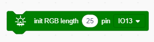

**Complete code:**

5. Test Result:

After uploading test code to ESP32 Easy Coding Board and powering on via USB cable, the RGB dot matrix alternately shows patterns of a small and a large heart.

### 2 Single RGB Blinking

1. Introduction:

In this project, we intend to control a certain RGB of the ESP32 Easy Coding Board to be on and off.

2. Components:

| ESP32 Easy Coding Board*1 |  |
| ------------------------- | ----------------- |
| USB type C Cable*1        |  |

3. Connection:

Connect the ESP32 Easy Coding Board to your computer via USB cable.

4. 5*5RGB Dot Matrix：

The RGB dot matrix has a total of 25 beads, and we mark them as number 0 to 24 from left to right and from top to bottom.

The serial number is as follows:

5. Test Code：

**Find code blocks:**

Initialize RGB

Set one RGB to light up in a certain color

Clear all RGB

Refresh all RGB

**Build blocks:**

6. Test Result：

The set RGB will light up once per second.

### 3 RGB Dot Matrix

1. Introduction:

Dot matrices are very commonplace in daily life, which are widely used in RGB advertisement screens, elevator floor display, bus stop announcement and so on.

The dot matrix of ESP32 Easy Coding Board contains 25 RGB in a grid.  Previously, we have succeeded in controlling a certain RGB to light by integrating its position value into the test code. Theoretically, we can light up multiple LEDs at the same time to show patterns, digits and characters.

What’s more, we can also click ”show icon“ to choose the pattern we like to display. Last but not the least, we can design patterns by ourselves as well.

2. Components:

| ESP32 Easy Coding Board*1 |  |
| ------------------------- | ----------------- |
| USB type C Cable*1        |  |

3. Connection:

Connect the ESP32 Easy Coding Board to your computer via USB cable.

4. Test Code：

**Find code blocks:**

**Build blocks:**

We set the icon to an arrow and set its brightness and color.

Set the brightness and animation time.

5. Test Result：

After uploading test code, the dot matrix starts to show arrows in multiple directions, and then it exhibits two animations with full color each 5s.

### 4 Programmable Touch Buttons 

1. Introduction:

Buttons can be used to control circuits. In an integrated circuit with a button, the circuit is connected when the button is pressed and if you release the button, the circuit is disconnected.

Capacitive touch detects the user’s operation by measuring changes in capacitance. When you touch the capacitive sensing area, the charge of the human body affects the value of the capacitor, which can be sensed by the module due to this change.

ESP32 Easy Coding Board boasts three buttons: two programmable buttons (marked with A and B), and a reset button at back. By pressing the two programmable buttons, three different signals can be input. When we press button A or B or both,  the LED dot matrix will show A, B and AB respectively.

2. Components:

| ESP32 Easy Coding Board*1 |  |
| ------------------------- | ----------------- |
| USB type C Cable*1        |  |

3. Connection:

Connect the ESP32 Easy Coding Board to your computer via USB cable.

4. Test Code 1:

**Find code blocks:**

Find “if…then…” block to determine whether the buttons are pressed.

**Build blocks:**

5. Test Result 1：

After uploading test code and powering on, the 5x5 dot matrix shows A if button A is pressed, and shows B if button B is pressed, and shows AB if buttons A and B are pressed together. When the touching area is touched, it shows T.

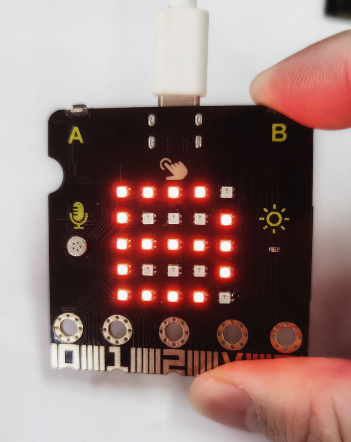

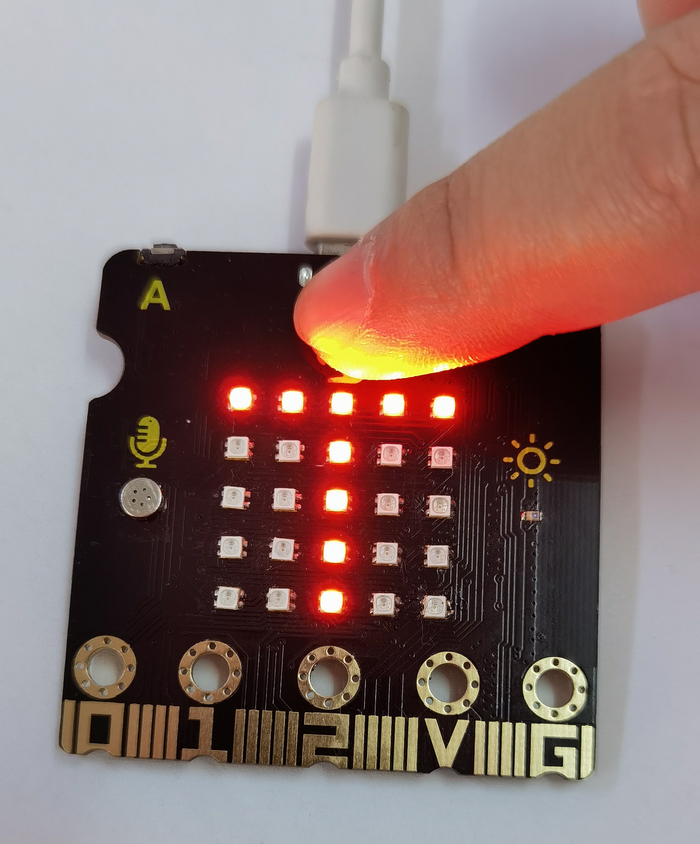

6. Test Code 2：

Read the touching area analog values.

**Find code blocks:**

**Build blocks:**

7. Test Result 2：

When you touch this area, the value will reduce to lower than 10.

### 5 Passive Buzzer

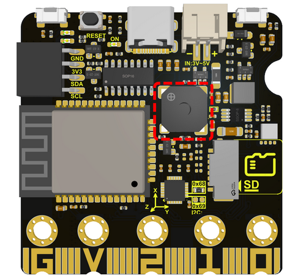

1. Introduction:

The board boasts an built-in passive buzzer, which is a device without an oscillating circuit, so it needs an external driving signal to produce sound.

- **Passive:** Unlike active buzzers, passive buzzers  do not include a built-in oscillator circuit, so an external driving signal with a certain frequency is required. This is usually done by a  microcontroller or other signal source.
- **Frequency control:** The frequency of the driving signal determines the frequency at which the buzzer produces sound. By changing the frequency of the input signals, different tones of sound can be played.
- **Applications:** Passive buzzers are widely used in various electronic devices to provide audio prompts or alerts, such as embedded systems, electronic products, alarm systems, etc.
- **Driving:** Due to its passiveness, they have relatively low requirements for external drive signals, so they usually only need to provide enough current and appropriate frequency.

2. Components:

| ESP32 Easy Coding Board*1 |  |
| ------------------------- | ----------------- |
| USB type C Cable*1        |  |

3. Connection

Connect the ESP32 Easy Coding Board to your computer via USB cable.

4. Test Code:

**Find code blocks:**

**Build blocks:**

Play do, re, mi, fa, sol, la, si, or you may compose them by yourself.

Integrated music and songs:

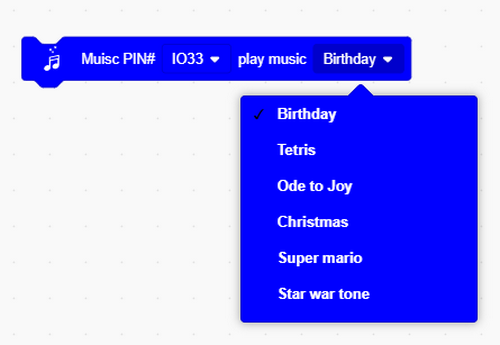

**Complete code:**

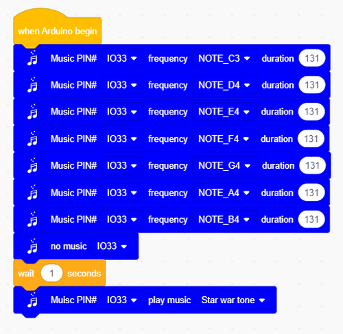

5. Test Result：

Play do, re, mi, fa, sol, la, si, and songs.

### 6 Microphone

1. Introduction:

Microphone is a device that converts sound into electrical signals,  which is an important part of the audio field. It is widely used in voice recording, communication and audio playback.

Microphones can be divided into many types, including **Dynamic Microphone**, **Condenser Microphone**, **Wireless Microphone**, **USB Microphone** and **Laser Microphone**.

In this project, we use a minimal capacitive microphone.

2. Components:

| ESP32 Easy Coding Board*1 |  |
| ------------------------- | ----------------- |
| USB type C Cable*1        |  |

3. Connection:

Connect the ESP32 Easy Coding Board to your computer via USB cable.

#### 
**Find code blocks:**

**Build blocks:**

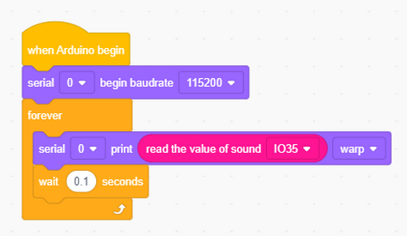

5. Test Result 1:

After uploading test code and setting baud rate to 115200, speak to the ESP32 Easy Coding Board or clap your hands or desks, the louder the sound is, the greater the value will be.

6. Test Code 2:

We represent the sound on RGB dot matrix, and the louder the sound, the more RGB will light up.

Initialize RGB.

Determine the sound level and rate it.

RGB display：

**Complete code:**

7. Test Result 2:

Upload test code and power on, and the louder the sound is, the more the RGB will light up.

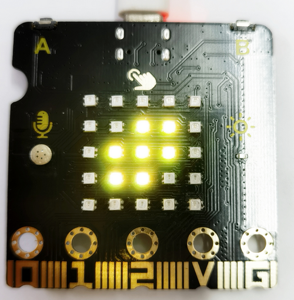

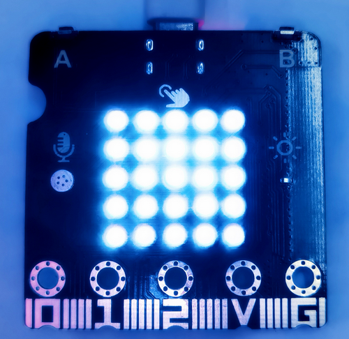

### 7 Temperature and Humidity Detection

1. Introduction:

AHT11 temperature and humidity sensor is equipped on the board, which outputs digital signals. It uses special analog signal acquisition, conversion technology and temperature and humidity sensing technology to ensure that the sensor features good long-term stability and high reliability. The MCU on the ESP32 Easy Coding Board communicates with it via I2C.

2. Components:

| ESP32 Easy Coding Board*1 |  |
| ------------------------- | ----------------- |
| USB type C Cable*1        |  |

3. Connection:

Connect the ESP32 Easy Coding Board to your computer via USB cable.

4. Test Code:

**Find code blocks:**

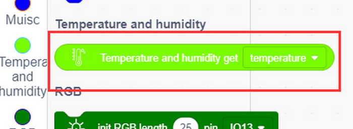

**Build blocks:**

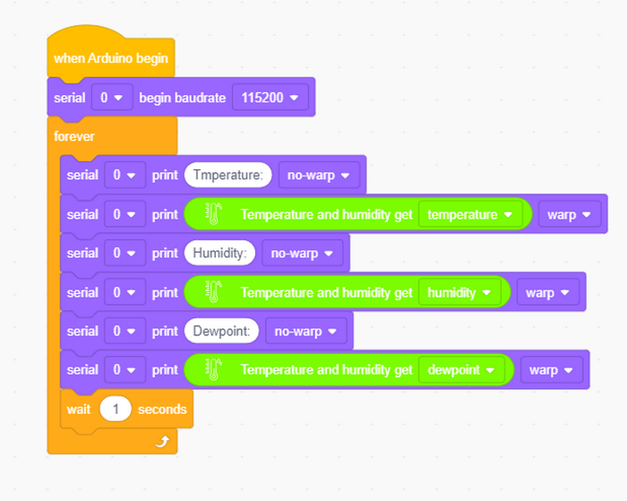

5. Test Result：

After uploading test code, open the serial monitor and set baud rate,  and the temperature, humidity and dew point value will be printed.

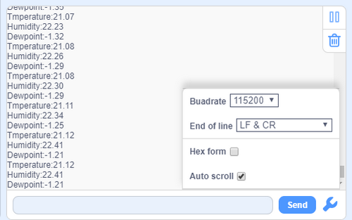

### 8 MPU6050 Accelerometer and Gyroscope

1. Introduction:

The MPU6050 is a six-axis motion processor that includes a 3-axis gyroscope and a 3-axis accelerometer. The two sensors are integrated on a single chip to detect static and dynamic object motion states, including angular speed, Angle and acceleration.

Its 16-bit ADC can simultaneously read data from six axes to measure diagonal speed and Angle, and infer acceleration information from the object. The MPU6050 also boasts a built-in temperature sensor to measure the temperature of the chip, helping to monitor the temperature of the sensor during  operation.

In addition, the MPU6050 is equipped with a fast Digital Motion Processor (DMP), which helps process raw data from the gyroscope and accelerometer to obtain the motion state of the object.

**Typical circuit diagram:**

|  #   | NAME |                         DESCRIPTION                          |
| :--: | :--: | :----------------------------------------------------------: |
|  1   | GND  |                   Negative interface (0V).                   |
|  2   | VCC  |               Positive interface (3.3V or 5V).               |
|  3   | SDA  |   I2C data line, connected to MCU, used to transmit data.    |
|  4   | SCL  | I2C clock line, connected to MCU, used to synchronize data transmission. |
|  5   | XDA  | I2C data line, connected to external extension sensors, used to transmit data. |
|  6   | XCL  | I2C clock line, connected to external extension sensors, used to synchronize data transmission. |
|  7   | AD0  | I2C Slave address. The sensor address is 0x69 at high and 0x68 at low. |
|  8   | INT  | External interrupt pin, detects the internal interrupt time of the MPU6050. |

- Operating voltage: 3.3V, 5V
- Static current: 5μA
- Rotating current: 3mA
- Maximum rotation speed: 2000°/s
- Acceleration range: ±2g, ±4g, ±8g, ±16g
- Temperature range: –10 ~ +65°C

MPU6050 can be used to measure the attitude of an object. Measurements of three angles are provided: **roll**, **pitch** and **yaw**. It can also provide the acceleration of the object, and obtain the speed and position information of the object through calculation.

**Its three axes:**

The corresponding **Euler Angle** indicates the Angle of rotation of the object in three-dimensional space, and its coordinate axis can be adjusted arbitrarily.

Euler Angle consists of three angles, namely **Roll**, **Pitch** and **Yaw**.

|   Roll    |   Rotation Angle with x-axis as rotation axis   |
| :-------: | :---------------------------------------------: |
| **Pitch** | **Rotation Angle with y-axis as rotation axis** |
|  **Yaw**  | **Rotation Angle with z-axis as rotation axis** |

 

When acquiring Yaw, the gyroscope inside the MPU6050 is automatically calibrated to zero, which causes Yaw to drift to zero.

**Zero drift** means that the detected data will have an accidental small fluctuation, for example, the sensor value will automatically have an accidental small change. Even after a good algorithm, zero drift still exists, as it is limited by hardware.

Solution: add a magnetometer to calibrate the MPU6050.

------

For more details, please refer to the MPU6050 data sheet:

[https://www.invensense.com/wp-content/uploads/2015/02/MPU-6000-Datasheet1.pdf](https://www.invensense.com/wp-content/uploads/2015/02/MPU-6000-Datasheet1.pdf)

[https://www.invensense.com/wp-content/uploads/2015/02/MPU-6000-Register-Map1.pdf](https://www.invensense.com/wp-content/uploads/2015/02/MPU-6000-Register-Map1.pdf)

2. Components:

| ESP32 Easy Coding Board*1 |  |
| ------------------------- | ----------------- |
| USB type C Cable *1       |  |

3. Connection:

Connect the ESP32 Easy Coding Board to your computer via USB cable.

4. Test Code 1:

**Find code blocks:**

**Build blocks:**

Initialize serial monitor and MPU6050.

This block is used to update the data each time it is fetched. 

**Complete code:**

5. Test Result 1：

After uploading code and powering on, Put ESP32 Easy Coding Board flatwise on the desk, press the reset button to initialize MPU6050, and wait 2 or 3 seconds.

When the serial monitor shows values, the initialization is completed; and if values on each axis is less than 10, the initialization is correct; otherwise you need to re-initialize it.

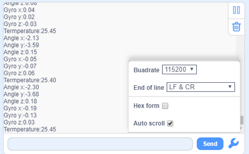

### 9 Light Intensity

1. Introduction:

Photoresistors measure light intensity and are commonly used to detect brightness in the surrounding environment.

**Working principle:** This module is designed by the light-sensitive materials. There are two main types: photoresistor and photodiode.

- **Photoresistor:** The resistance of a photoresistor varies with the intensity of ambient light. For one photoresistor, the  stronger the ambient light, the lower the resistance will be.
- **Photodiode:** The current output of a photodiode is proportional to the intensity of the incident light. The electrical signals they produce can be used to measure light brightness.

**Applications:** Photoresistors are widely applied to various fields, including light control systems, lighting systems,  camera exposure control, light monitoring, automatic adjustment of screen brightness, etc.

**Unit of brightness:** They usually measure light intensity in illuminance units (such as Lux). Illuminance represents the luminous flux per unit area.

2. Components:

| ESP32 Easy Coding Board*1 |  |
| ------------------------- | ----------------- |
| USB type C Cable*1        |  |

3. Connection:

Connect the ESP32 Easy Coding Board to your computer via USB cable.

4. Test Code:

**Find code blocks:**

**Build blocks:**

5. Test Result：

Upload the test code and open the serial monitor. When the light intensity detected by the sensor changes, the sensor values will also change.

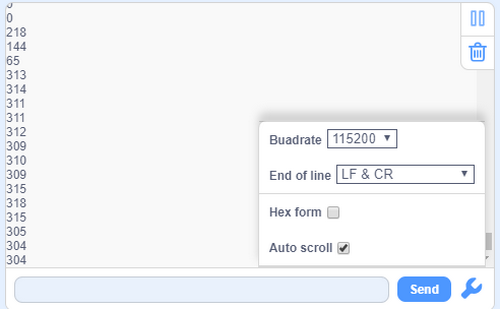

### 10 Read SD Card

1. Introduction:

The SD card module is used in conjunction with the MCU on the ESP32  Easy Coding Board for reading and writing data on the SD (Secure  Digital) card. This module makes it easier to use SD cards to store and access data in projects.

- **Function:** SD card module allows the ESP32 Easy Coding Board to communicate with the SD card to achieve data reading and writing. This is very useful for data logging, file storage, logging,  etc.

- **Interface:** The SD card module usually connects  to the ESP32 Easy Coding Board using the Serial Peripheral Interface  (SPI) interface. It needs to be connected to the corresponding pin of the ESP32 Easy Coding Board, For example, MOSI (Master Out Slave In),  MISO (Master In Slave Out), SCK (Serial Clock), and CS (Chip Select).

- **SD card type:** SD card modules are generally compatible with various types, including standard SD cards, SDHC cards  (High Capacity), and SDXC cards (extended Capacity).

  

2. Components:

| ESP32 Easy Coding Board*1            |   |
| ------------------------------------ | ------------------ |
| USB type C Cable*1                   |   |
| SD Card*1（not included in the kit） | 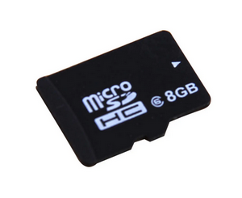 |

3. Connection:

Connect the ESP32 Easy Coding Board to your computer via USB cable.

Insert the SD card into the slot.

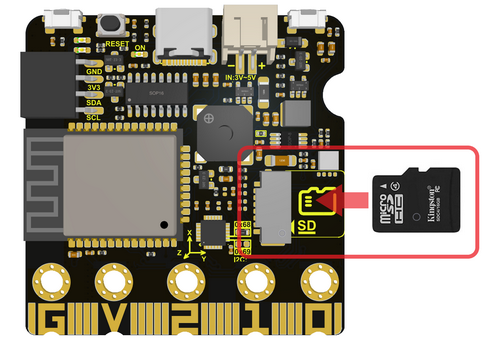

4. Test Code:

**Find code blocks:**

Initialize the serial monitor and SD card.

Refresh the SD data before using.

Read SD card type

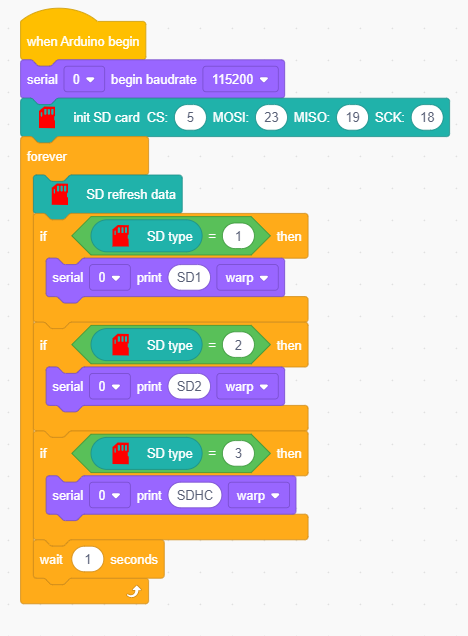

Serial port output:

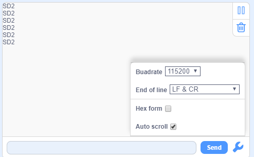

Read SD card message

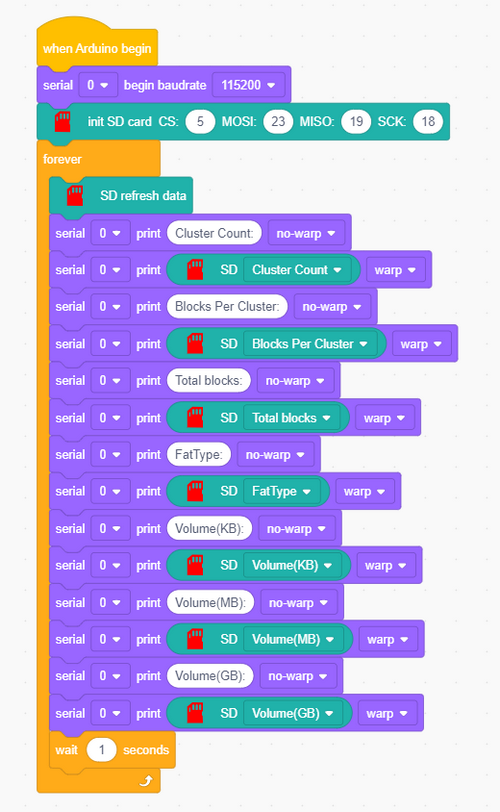

Serial monitor output：

File：

Determine whether there is a ‘’file.txt‘’ file in SD card.

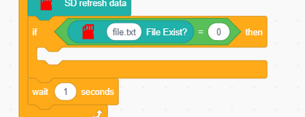

If there is no ‘’file.txt‘’, create a file and input “hello,world” in a new line.

After that, read the content in ‘’file.txt‘’.

Read all list files in SD card, including hidden files.

Delete this ‘’file.txt‘’.

**Complete code:**

Serial monitor output:

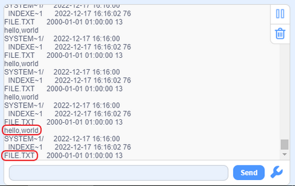

### 11 Read ESP32 Easy Coding Board Current

1. Introduction

ESP32 Easy Coding Board boasts a built-in current measurement module (only measure USB power supply and PH2.0 interface power supply) to  measure current by a resistive current sensor.

Resistive current sensor is commonly used to monitor the current value by measuring the voltage drop generated by the current through the resistance. The working principle of such sensors is based on Ohm’s  law, which states that when a current passes through a resistor, the voltage generated at both ends of the resistor is proportional to the current.

- **Current sensing:** Resistive current sensor contains a current sensing element, usually a resistor. When current passes through this resistor, a voltage drop will be generated at both ends of the resistor, the magnitude of which is proportional to the strength of the current.
- **Voltage output:** By measuring the voltage drop at both ends of the resistor, the sensor can provide a voltage signal that is related to current. This voltage signal can be digitally processed by devices like an analog-to-digital converters (ADC).

Resistive current sensors are widely applied to power system monitoring, power consumption measurement of electronic devices,  electric vehicle current monitoring and so on.

2. omponents:

| ESP32 Easy Coding Board*1 |  |
| ------------------------- | ----------------- |
| USB type C Cable*1        |  |

3. onnection:

Connect the ESP32 Easy Coding Board to your computer via USB cable.

4. est Code 1:

**Read current value:**

5. est Result 1：

After uploading test code, open the serial monitor and you will see the current value is 0. Because many modules are not working on the board,  so the current is close to 0.

6. est Code 2:

Enable RGB dot matrix and then measure the current value.

Initialize the serial monitor and RGB dot matrix.

First measure 10 RGBs.

Then measure 18 RGBs.

Last measure 25 RGBs.

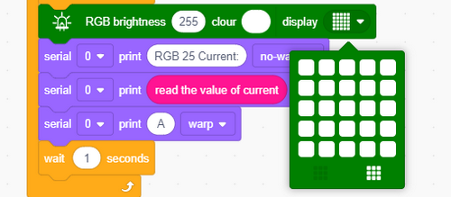

**Complete code:**

7. est Result 2:

Upload test code and you will find that the more the RGB, the larger the current will be.

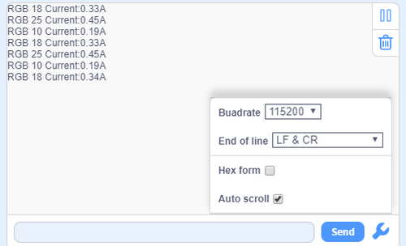

8. est Code 3:

The conversion of current to power: power (P) equals to current (I) times voltage (V).

*P*=*I*×*V*

- *P* is power, unit: Watt(W)
- *I* is current, unit: ampere(A)
- *V* is voltage, unit: volt(V)

This formula is suitable for DC circuits.

For AC circuits, power calculation may require more complex formulas due to power factor.

In a circuit, power describes the conversion of electrical energy.  Input current and voltage values into the above formula and you can get real-time power values.

This is commonly used for energy monitoring, power system management and equipment power consumption evaluation.

The power voltage of ESP32 Easy Coding Board is 3.3V, so we only need to measure the current and multiply it by 3.3 to get the power of the Board at this time.

------

Create variables **P** and **I**.

Assign the read current value to variable I.

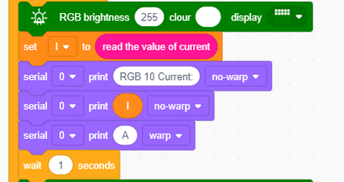

I multiplies by 3.3 is power of the ESP32 Easy Coding Board(the board voltage is 3.3V).

**Complete code:**

9. est Result 3:

Upload code and open serial monitor to set baud rate. The more the RGBs, the greater the current value and power will be.

### 12 Wifi Wireless Communication

ESP32 Easy Coding Board is built with Wi-Fi (2.4G) and Bluetooth (4.2)  to easily connect to a Wi-Fi network and communicate with other devices in the network, so you can use this Board to display web pages in your browser.

**ESP32 Easy Coding Board WiFi Function**

- **Base mode (STA / Wi-Fi Client mode)**: ESP32 Easy Coding Board is connected to a Wi-Fi hotspot (AP).
- **AP mode (Soft-AP / Wi-Fi hotspot mode)**: Other Wi-Fi devices connect to ESP32 Easy Coding Board.
- **AP-STA mode**: ESP32 Easy Coding Board is both a Wi-Fi hotspot and a Wi-Fi device connected to another Wi-Fi.
- These modes support multiple security modes: WPA, WPA2, WEP, etc.
- Wi-Fi hotspots can be searched (active and passive scanning).
- Support hybrid mode monitoring of IEEE802.11 Wi-Fi packets.

------

For more wifi reference, please visit ：[https://docs.espressif.com/projects/esp-idf/en/latest/esp32/api-reference/network/esp_wifi.html](https://docs.espressif.com/projects/esp-idf/en/latest/esp32/api-reference/network/esp_wifi.html)

Espressif Official ：[https://www.espressif.com.cn/en/home](https://www.espressif.com.cn/en/home)

**wifi Web Page**

Add an extension of web page editing.

Connect a Wifi and input your wifi name and password. After connecting, the IP address will be printed on the serial monitor.

Set up a web component named **temperature** in the unit of ℃.

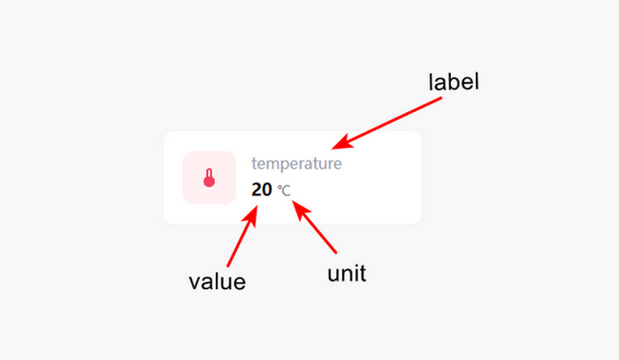

Add a button module named **button**.

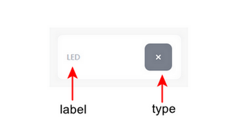

**Complete code:**

As long as connecting the Wi-Fi, you may use the Web Server Library of ESP32 Easy Coding Board to provide web page.

In the example, we set up a simple web page to display a certain temperature value.

**Open your browser to check and visit the IP address of ESP32  Easy Coding Board. Herein, you may access to “http://[IP address of  ESP32 Easy Coding Board]” to visit its website.**

**NOTE: When PC, mobile phone and ESP32 Easy Coding Board are connected to one network, this website(your own IP address of ESP32 Easy Coding Board) can be accessed via PC and mobile at the same time.**

PC：

Mobile：：

