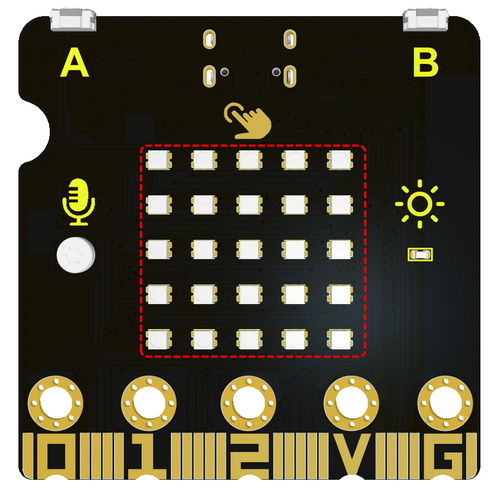
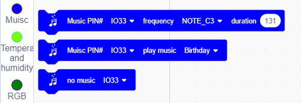

# ESP32 Distance Detection Robot Projects

## 1.Tutorial

Code Download： [Tap it to download codes](./Code/code.zip)

### 1.1 Ultrasonic Sensor

Description: The project introduces the basic knowledge of ultrasonic. Students will use an ultrasonic sensor to print the detected distance via the serial port.

 1.1.1 Introduction

The HC-SR04 ultrasonic sensor uses sonar to determine distance to an object like what bats do. It offers excellent non-contact range detection with high accuracy and stable readings in an easy-to-use package. It comes with an ultrasonic transmitter and a receiver module.

The HC-SR04 or the ultrasonic sensor is being used in a wide range of electronics projects for creating obstacle detection and distance measuring application as well as various other applications. 

 1.1.2 Module Parameters

 1.1.3 Wiring Diagram

| Expansion Board |  Module  |
| :-------------: | :------: |
|       3V3       |   VCC    |
|      TRIG       | P12/io15 |
|      ECHO       |  P8/io4  |
|       GND       |   GND    |

 1.1.4 Code

Add extension module

Search ULTRASONIC

Tap Loaded

Initialize serial port

Add code of the ultrasonic module 

**Complete code:**

 1.15 Result

CoolTerm download：<https://freeware.the-meiers.org/>

Open the serial port monitor and select the corresponding baud rate.

Move your palm in front of the ultrasonic and the corresponding distance will be detected.

（Note: This is not a professional distance detection instrument, it is only for learning purposes.）

### 1.2 Magical Ultrasonic Rangefinder

Description: In this project, students will learn how to use ultrasonic sensor and RGB dot matrix module to make a rangefinder.
Students will learn how to display the detected distance through RGB dot matrix and feel the magic of technology.

RGB Basic Projects： [Basic Courses:ESP32 Easy Coding Board](Basic_Courses.md)

 1.2.1 Code 1

Make a 1~10 circular lamp

Initialize the RGB 

Set the brightness and color, then set the 1~10 graphics：

**Complete code:**

 1.2.2 Result 1

After uploading the code, the RGB dot matrix will display the lamp with the numbers 1 to 10.

 1.2.3 Code 2

Display the distance detected by ultrasonic via RGB dot matrix (only display the distance from 1~10).

Initialize the RGB

Add an RGB function

Add a variable

Assign the detected distance to the variable

Add if then to the function

Add RGB display 

**Complete code:**

 1.2.4 Result 2

The RGB dot matrix displays the detected distance.

### 1.3 Ultrasonic Guardian

Description: This project will teach students how to use an ultrasonic sensor, a RGB dot matrix display and a buzzer to make an early warning system.
Students will learn how to display distance information via RGB dot matrix and use the buzzer to sound an alarm, thus realizing the object early warning function.

A passive buzzer is a buzzer that does not have a built-in oscillation circuit and requires an external driving signal to produce sound.

 1.3.1 Code 1

**Find code blocks:**

**Build blocks:**

Play do, re, mi, fa, sol, la, si, or you may compose them by yourself.

Integrated music and songs:

**Complete code:**

 1.3.2 Result 1

Play do, re, mi, fa, sol, la, si, and songs.

 1.3.3 Code 2

Add buzzer alarm function in the code of project 1.2.3.

Add buzzer code in the RGB function in the code of project 1.2.3.

**Complete code:**

 1.3.4 Result 2

The closer the robot detects the object, the higher the pitch.

------

## 2.FAQ

 Q：Battery Model？

A: 4 AAA batteries. Please mount batteries in the right direction! Please do not reverse them! For younger students, please do those experiments accompanied by your parents!

------

 Q：Errors occur during burning codes to ESP32 board?

A: 

- Please check the USB port.
- Please check the board model.

------

 Q：Extend to other modules?

A: Yes. For details, please refer to the pin-out description of ESP32 board to make sure that the extended modules are available in functions. 

------

## 3.**Resources**

Our website：

[https://www.keyestudio.com/](https://www.keyestudio.com/)

Arduino official website：

[https://www.arduino.cc/](https://www.keyestudio.com/)

ESP32 Espressif official website：

[https://www.espressif.com/](https://www.keyestudio.com/)
