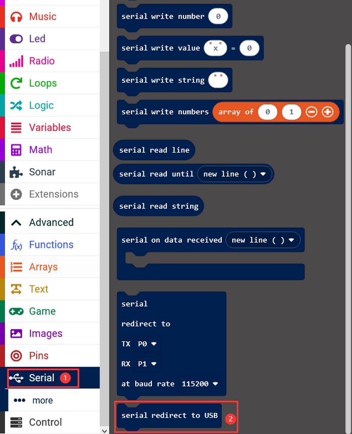
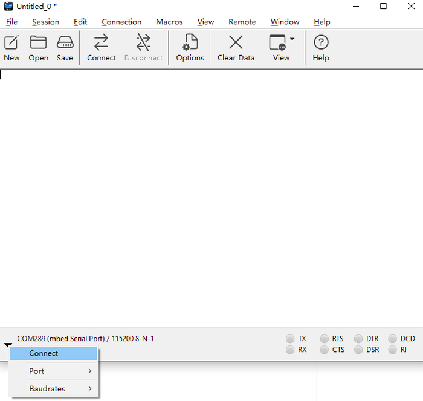
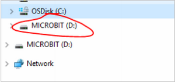

# Micro:bit Distance Detection Robot Projects

## 1.Tutorial

Code Download： [Tap it to download codes](MakeCode/code.zip)

### 1.1 Ultrasonic Sensor

Description: The project introduces the basic knowledge of ultrasonic. Students will use an ultrasonic sensor to print the detected distance via the serial port.

1.1.1 Introduction

The HC-SR04 ultrasonic sensor uses sonar to determine distance to an object like what bats do. It offers excellent non-contact range detection with high accuracy and stable readings in an easy-to-use package. It comes with an ultrasonic transmitter and a receiver module.

The HC-SR04 or the ultrasonic sensor is being used in a wide range of electronics projects for creating obstacle detection and distance measuring application as well as various other applications. 

1.1.2 Module Parameters

1.1.3 Wiring Diagram

| Expansion Board |  Module  |
| :-------------: | :------: |
|       3V3       |   VCC    |
|      TRIG       | P12/io15 |
|      ECHO       |  P8/io4  |
|       GND       |   GND    |

1.1.4 Code

Add extension module

Search sonar and add it

Click Make a Variable

Set serial port

Initialize ultrasonic sensor, assign the read ultrasonic value to the variable

Print the ultrasonic value on the serial monitor

1.15 Result

Open the serial port monitor and select the corresponding baud rate.

Move your palm in front of the ultrasonic and the corresponding distance will be detected.

（Note: This is not a professional distance detection instrument, it is only for learning purposes.）

### 1.2 Magical Ultrasonic Rangefinder

Description: In this project, students will learn how to use ultrasonic sensor and RGB dot matrix module to make a rangefinder.
Students will learn how to display the detected distance through RGB dot matrix and feel the magic of technology.

RGB Basic Projects ：[Basic Courses:Microbit](Basic_Courses.md)

1.2.1 Code 1

Make a 1~10 circular lamp

**Complete code:**

1.2.2 Result 1

After uploading the code, the RGB dot matrix will display the lamp with the numbers 1 to 10.

1.2.3 Code 2

Display the distance detected by ultrasonic via LED dot matrix (only display the distance from 1~10).

Make a variable

Assign the detected distance to the variable

Display the detected data via the LED dot matrix

**Complete code:**

#### 1.2.4 Result 2

The LED dot matrix displays the detected distance.

### 1.3 Ultrasonic Guardian

Description: This project will teach students how to use an ultrasonic sensor, a RGB dot matrix display and a buzzer to make an early warning system.
Students will learn how to display distance information via RGB dot matrix and use the buzzer to sound an alarm, thus realizing the object early warning function.

A passive buzzer is a buzzer that does not have a built-in oscillation circuit and requires an external driving signal to produce sound.

1.3.1 Code 1

**Find code blocks:**

**Build blocks:**

1.3.2 Result 1

Download the code to the micro:bit mainboard and power on via the micro USB cable. The speaker on the micro:bit mainboard will make a sound and the LED matrix will display the music logo.

1.3.3 Code 2

Add buzzer alarm function in the code of project 1.2.3.

Add buzzer code in the LED function in the code of project 1.2.3.

**Complete code:**

1.3.4 Result 2

The closer the robot detects the object, the higher the pitch.

------

## 2.Troubleshooting

### 2.1 Code fails to be downloaded to Micro:bit

**Problem**

Recently, many users encounter the issue that Micro:bit board doesn’t respond when downloading code.

If the way you operate is correct, maybe you accidentally press the reset button and enter the Maintenance mode or the firmware is lost due to mis-operation.

Plug in Micro:bit board, the “MAINTENANCE” drive appears, which means the program can’t be downloaded.

**Solution**

1. Download the **hex file** from this page to your computer.

   Down load the latest micro:bit firmware-0255: <https://www.microbit.org/get-started/user-guide/firmware/>
   If you do not want to download from this website, we also provide it in our tutorial.

2. After the latest firmware is downloaded, then drag it into the “MAINTENANCE” to make Micro:bit back to normal mode.

**Avoid to Enter “MAINTENANCE”**

1. Make sure the Reset button is **not** pressed when plugging the board by USB cable.

      

      

2. Don't unplug the cable suddenly during downloading micro:bit program, otherwise, the firmware will be lost and micro:bit will enter “MAINTENANCE” mode.
3. In the experiment, wrong wiring also cause a short circuit or firmware lost.

------

### 2.2 Troubleshooting-Download with WebUSB

Having trouble pairing the Micro: bit with WebUSB (/ device/usb/webusb)?

**2.2.1 Step 1: Check cable**

Make sure that your micro:bit is connected to your computer with a micro USB cable. You should see a **MICROBIT** drive appear in Windows Explorer when it’s connected.

**If you can see the MICROBIT, please go to step 2**.

If not:

- Make sure that the USB cable is working. Will the cable work on another computer? If not, find a different cable to use. Some cables may only provide a power connection and don’t actually transfer data.
- Try another USB port on your computer. 
- Is the cable good but you still can’t see the **MICROBIT** drive? Then you might have a problem with your micro:bit. 
- Try the additional steps described in the [falut finding](https://support.microbit.org/support/solutions/articles/19000024000-fault-finding-with-a-micro-bit) at microbit.org.
- If this doesn’t help, you can create a [support ticket](https://support.microbit.org/support/tickets/new) to notify the Micro:bit Foundation of the problem.

------

**2.2.2 Step 2: Check firmware version**

It’s possible that the firmware version on the micro:bit needs an update. Let’s check:

1. Go to the **MICROBIT** drive.
2. Open the **DETAILS.TXT** file.

3. Look for the version number. It should say **Version: ...**

Or **Interface Version: ...**

If the version is **0234**, **0241**, **0243**, you need to update the firmware (/device/firmware) on your micro:bit. Go to **Step 3** and follow the upgrade instructions.

If the version is **0249**, **0250** or higher, you have the right firmware, just go to **step 4**.

------

**2.2.3 Step 3: Update firmware**

1. Put your micro:bit into **MAINTENANCE Mode**. 

   To do this, please unplug the USB cable from the micro:bit and then re-connect the USB cable after pressing and holding the reset button. Once you insert the cable, you can release the reset button. You should now see **MAINTENANCE** instead of the **MICROBIT** drive. Also, a yellow LED indicator will stay on. 

2. Download firmware .hex file: <https://microbit.org/guide/firmware/>
3. Drag the file into the **MAINTENANCE** drive.
4. The yellow LED will flash while the HEX file is copying. After that, the LED will go off and the micro:bit resets. The **MAINTENANCE** drive now changes to **MICROBIT**.
5. The upgrade is complete! You can open the **DETAILS.TXT** file to check the firmware version that matches the one of the **HEX** file you copied.

If you want to know more about connecting the board, MAINTENANCE Mode, and upgrading the firmware, please refer to [Firmware guide](https://microbit.org/guide/firmware/).

------

**2.2.4 Step 4: Check version of Browser**

WebUSB may require you to update your browser. 

Check that your browser version matches one of these: **Android**, **Chrome OS**, **Linux**, **macOS** and **Windows 10 Chrome 65+**. 

------

**2.2.5 Step 5: Pair device**

Once you’ve updated the firmware, open the **Chrome Browser**, go to the editor and click on **Pair Device** in settings. 

See [WebUSB](https://microbit.org/get-started/user-guide/web-usb/) (/ device / usb / webusb) for pairing instructions.

------

## 3.**Resources**

Our website：

[https://www.keyestudio.com/](https://www.keyestudio.com/)

MicrobitCode：

<https://makecode.microbit.org/>

Microbit official website：

<https://www.microbit.org/>