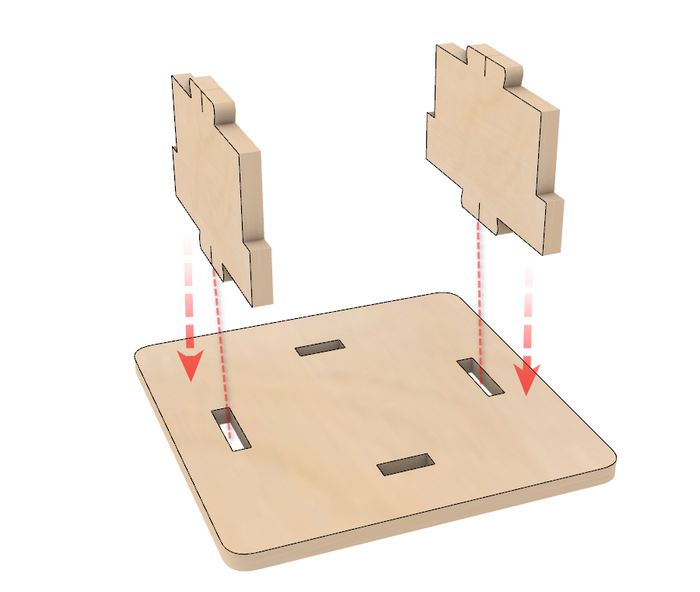
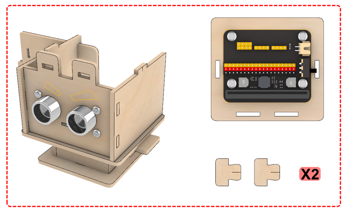
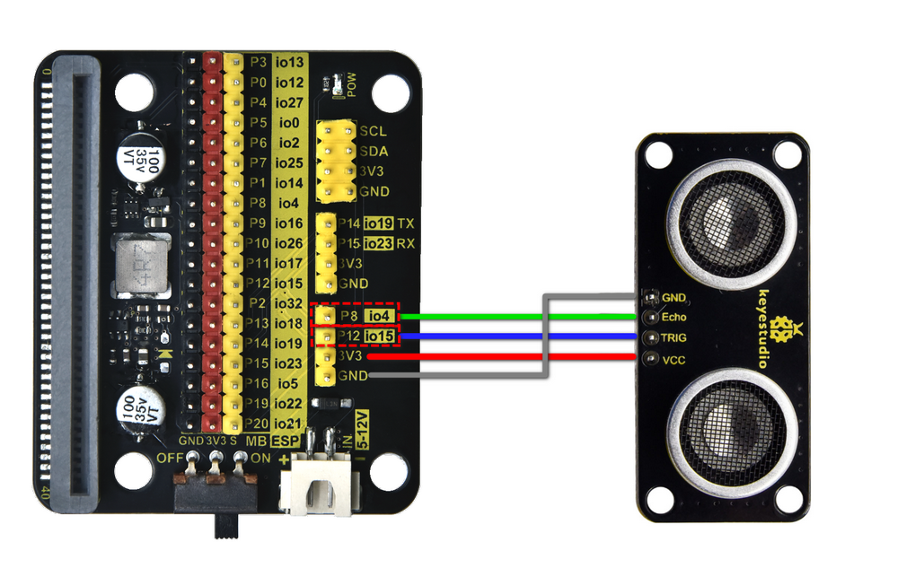
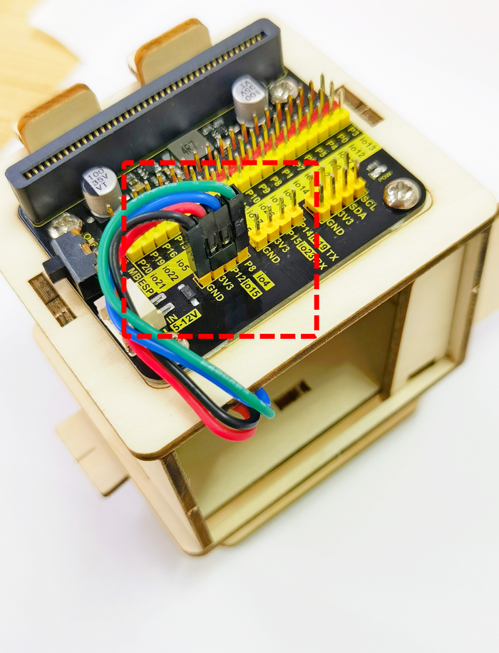
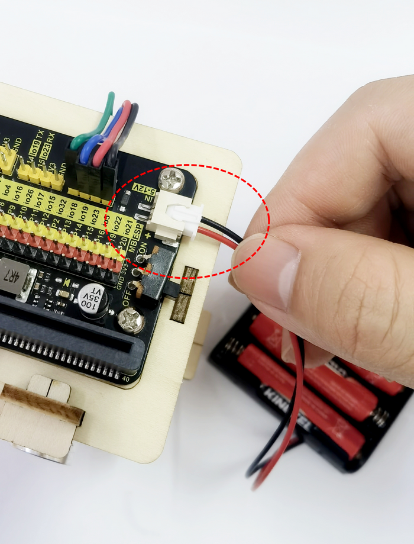

**Thank you for choosing keyestudio!**

**We will endeavor to provide you with better products and services!**

------

**About keyestudio**

Keyestudio is the best-selling brand owned by KEYES Corporation. Our product contains Arduino development and expansion boards, sensors and modules, Raspberry Pi, micro:bit expansion boards as well as smart cars and learning kits, which can help customers at any level to learn about Arduino.

Notably, all of our products are in line with international quality standards and are greatly appreciated in a broad menu of different markets across the world.

Welcome to check out more contents from our official website:

[http://www.keyestudio.com](http://www.keyestudio.com)

------

**Obtain Information and After-sales Service**

Code Download：

[ESP32](ESP32/Code/code.zip)

[Microbit](Microbit/MakeCode/code.zip)

1. If something is found missing or broken, or you have some difficulty learning the kit, please feel free to contact us. Welcome to send email to us：

   [service@keyestudio.com](http://m.138.gz.cn/webadmin/~CAmsnCrrNXhTAySKCerrIfWjjZuuWVfI/~/usr/mod_edituser.jsp?;uid=service@keyestudio.com;;clearCache=)

2. We will endeavor to update projects and products continuously from your sincere advice! 

------

**Warning**

1. This product contains tiny pin headers, so please keep out of reach of children under 7 to prevent from lacerations. 
2. This product also contains conductive parts(control board and electronic modules). Please operate according to the requirements of tutorials. Otherwise, improper operation may damage parts due to overheating. In this case, do not touch it and immediately disconnect the circuit power.

------

**Copyright**

The Keyestudio trademark and logo are the copyright of **KEYES DIY ROBOT co.,LTD**. All products under Keyestudio brand can’t be copied, sold or resold without authorization by anyone or any company.

If you are interested in our products, please contact to our sales representatives：[fennie@keyestudio.com](http://m.138.gz.cn/webadmin/~CAmsnCrrNXhTAySKCerrIfWjjZuuWVfI/~/usr/mod_edituser.jsp?;uid=fennie@keyestudio.com;;clearCache=)

------

# STEM Programming DIY Distance Detection Robot Kit

------

## Kit List

| # |                             PIC                             |      NAME      | QTY |
| :--: | :----------------------------------------------------------: | :------------: | :----: |
| 1   |                                            |    Expansion Board    |   1 |
| 2   |                                            |    Battery Holder    |   1 |
|  3   |                                            |     Basswood Board     |   1    |
|  4   |                                            | M3*8mm Screw |   4    |
| 5   |  | M4*8mm Screw |   4 |
| 6   |  | M3 Nut |   4 |
|  7   |  |   M4 Nut   |   4    |
|  8   |  |     4PIN DuPont Wire     |   1    |
| 9   |  | Ultrasonic Sensor |   1 |
| 10  |                        |  Screwdriver  |   1 |

------

## Description

In this product, we seek to use basswood boards to make a distance detection robot kit.

The kit uses an ultrasonic sensor that is compatible with the micro:bit board and the ESP32 Easy Coding Board, which can detect the distance to the object. You can use programming software such as Makcode and KidsBlock to write unique codes to achieve more creative and interesting functions.

With this kit, you can master basic sensor knowledge and learn programming. Moreover, it is a good way for you to stimulate your creativity and talent to create robots with multiple functions.

------

## Features

1. **Easy assembly：** The assembly process is very easy.
2. **Intelligent distance detection：** The robot is equipped with an ultrasonic distance detection module that can sense obstacles and distance changes in the surrounding environment in real time.
3. **Modular design：** The robot adopts a modular design, so users can freely combine and replace different modules according to their needs to achieve personalized customization.
4. **Multiple programming methods：**  It boasts Makcode and KidsBlock programming methods, which significantly meet diversified programming needs.  

------

## Assembly

step1

step2

Wiring Diagram

step3

step4

step5

step6

step7

step8

Wiring 

| Expansion Board | Module |
| :-------------: | :----: |
|     P8/io4      |  ECHO  |
|    P12/io15     |  TRIG  |
|       3V3       |  VCC   |
|       GND       |  GND   |

step9

Assemble Battery (4 AAA batteries need to be purchased separately)

Insert it into the expansion board

Put the battery holder into the robot body

Close the robot hatch

Insert latch

step10

Assembly of Development Board

ESP32

Microbit

## Resources

[https://www.keyestudio.com/](https://www.keyestudio.com/)

[https://wiki.keyestudio.com/Main_Page](https://wiki.keyestudio.com/Main_Page)

<https://microbit.org/new-microbit/>

[https://www.espressif.com/](https://www.espressif.com/)

------

## Tutorials

Code Download：

[ESP32](ESP32/Code/code.zip)

[Microbit](Microbit/MakeCode/code.zip)

### 1.Basic Projects

The basic tutorial includes an introduction to the development board,  how to use programming software, how to burn code, and how to use  onboard sensors and modules.

Note：If you are a novice, learn the basic tutorial for the corresponding development board (Micro:bit / ESP32 Easy Coding Board) first, so that  you will learn how to use programming software and upload code.

[Basic Courses:Microbit](Microbit/Basic_Courses.md)

[Basic Courses:ESP32 Easy Coding Board](ESP32/Basic_Courses.md)

2.Distance Detection Robot Projects

Do operations according to the tutorials of the two development boards.

2.1 Microbit Tutorial

[Micro:bit](Microbit/Microbit.md)

2.2 ESP32 Easy Coding Board Tutorial

[ESP32](ESP32/ESP32.md)

------

